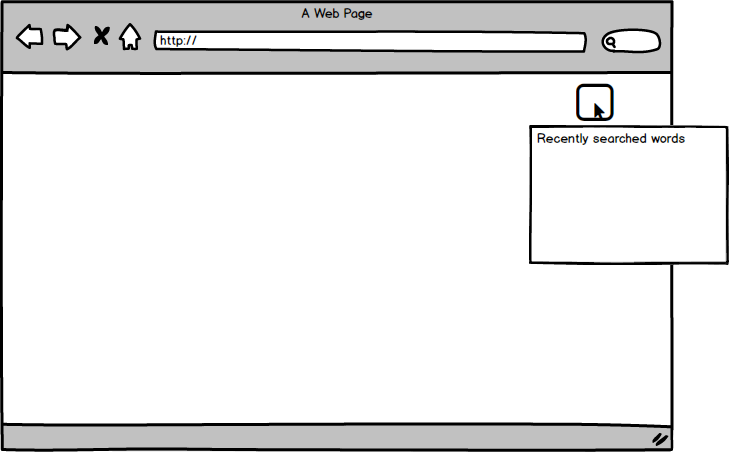

# Upword
Upword is a chrome extension that helps you look up words! Easily find the definition and synonyms with the press of a key.
This eliminates the pain point of opening up a new tab to search for words.

## Functionality & MVP
* Be able to search up the definition of a word
* Search up synonyms of word
* Live swap of synonyms
* O-Auth for Gmail

## Wireframes
</img>

</img>

## Technologies & Technical Challenges
Upword will be a Google Chrome Extension built with standard Chrome Extension architecture. The main files being a `manifest.json` and `package.json`. In addition to those files we’ll also have `CSS` and `JS` directories. The css files needed are:
- `word.css` which will handle the highlight formatting
- `dropdown.css` will handle the styling of the dropdown
- `options.css` will handle the styling of the options menu

For the JS directory, the following files will be used:
- `options.js` will contain the logic for changing the user's settings
- `api_util.js` will handle logic for making api requests to our server
- `word_api_util.js` will handle api requests to external api for finding synonyms

The primary technical challenges will be:
- Allowing users to see a dropdown on any word clicked
- Rendering the matched words quickly
- Using hotkeys to see words

## Implementation Timeline

**Day 1**
- Learn more about making chrome extensions
- Make all design decisions regarding architecture.
- Setup files necessary

**Day 2**
- Have a working extension
- Make requests to external api
