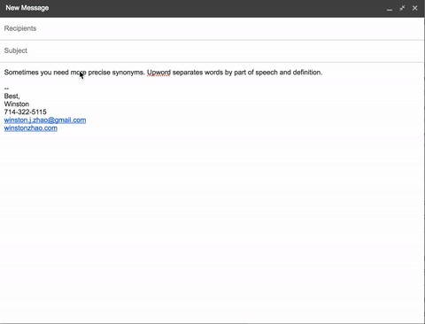

# Upword

Upword is a Chrome Extension that allows users to quickly replace words with their synonyms in gmail. Upword can also be configured using a hotkey (in development).

+ [Check out the Upword Site](https://winstonjz.github.io/upword-site/)
+ [Download in the Chrome Extension Store](https://chrome.google.com/webstore/detail/upword/caccnpmojcgaglgnmbchfodecmfkcjkl?authuser=3)

### Instructions

1. [Download in the Chrome Extension Store](https://chrome.google.com/webstore/detail/upword/caccnpmojcgaglgnmbchfodecmfkcjkl?authuser=3)

2. When composing an email in gmail, Right click on any word that you are interested in changing and find 'Look Upword' in the context menu

3. The Upword dropdown will appear. Click through tabs and find the word that you like and it will swap in real time!

4. Click to confirm your selection and the Upword dropdown will close and your word will change.
