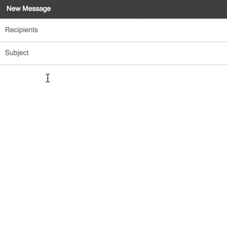

## Upword

Upword is a Chrome Extension that allows user to quickly replace words with their synonyms. Upword can also be configured using a hotkey (in development).

### Installation instructions

Download the zip [here](#)

1. Unzip the file

2. Go to the Chrome Extensions ([here](chrome://extensions/))

3. Check 'Developer Mode'

4. Click 'Load Unpacked Extension'

5. Select the unzipped folder

6. Enjoy!
