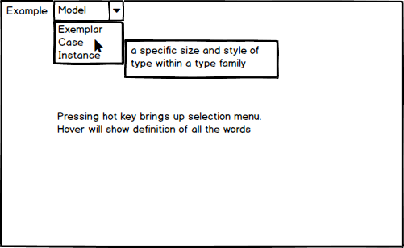

# Upword
Upword is a chrome extension that helps you look up words! Easily find the definition and synonyms with the press of a key.
This eliminates the pain point of opening up a new tab to search for words.

## Functionality & MVP
* Be able to search up the definition of a word
* Search up synonyms of word
* Live swap of synonyms
* O-Auth for Gmail

## Wireframes
</img>

</img>

## Technologies & Technical Challenges
Upword will be a Google Chrome Extension built with standard Chrome Extension architecture. The main files being a `manifest.json` and `package.json`. In addition to those files we’ll also have `CSS` and `JS` directories. The css files needed are:
- `word.css` which will handle the highlight formatting
- `dropdown.css` will handle the styling of the dropdown
- `options.css` will handle the styling of the options menu

For the JS directory, the following files will be used:
- `options.js` will contain the logic for changing the user's settings
- `api_util.js` will handle logic for making api requests to our server
- `word_api_util.js` will handle api requests to external api for finding synonyms

We will use react to respond to user input and render synonyms and details on the synonyms. 
The components we will be using are: 
- list.jsx
- word.jsx
- info.jsx

We will handle the logic for live swapping on in our list.jsx. The current word will be in "this.state.currentWord" and when the user clicks on another word in the list the new word will be replaced in the state and "live-swapped" into the textfield through a re-render.

The api we will be using is Words Api found at https://www.wordsapi.com/. The api will provide us the following: 
- Definitions
- Synonyms
- Example sentences

We will utilize Redux to perform our api requests to Words Api: 
- on list - word hover
- on word highlight
- hotkey press

The primary technical challenges will be:
- Allowing users to see a dropdown on any word clicked
- Live swap of text being typed
- Rendering the matched words quickly
- Using hotkeys to see words

## Implementation Timeline

**Day 1**
- Learn more about making chrome extensions
- Make all design decisions regarding architecture.
- Setup files necessary

**Day 2**
- Have a working extension
- Set up redux cycle to make requests to external api
- Display unstyled results in react component

**Day 3**
- Begin styling 
- Get basic live swap working using react state

**Day 4**
- Create on hover effects for word.jsx
- Finish styling
- Squash bugs

